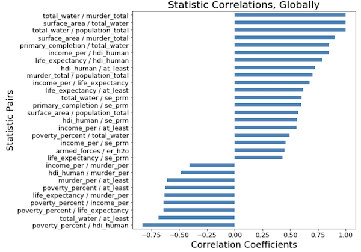

# GoFish
> This project is a work in progress

Use Python to search Gapminder.org datasets for possible features of interest:

1. feature pairs with a moderate to strong Pearson's correlation coefficient
2. additional filters TBD

A possible improvement to this project is to incorporate machine learning.



## Motivation

Gapminder.org offers a large number 'global facts' datasets, available for download (https://www.gapminder.org/data/). Most of these datasets include feature calculations for each country for a range of years. For example: the population of each country starting in 1800 and forecasted through to 2100.  

As a Data Analyst looking for correlations between any number of datasets. In order to narrow the scope of my data exploration, I wanted to simply pile a bunch of CSV files together then programmatically create a Pearson correlation coefficients report on all feature pairs. That's when I started developing GoFish.

## Installation

Clone the GitHub repository.

```sh
$ git clone https://github.com/leaherb/GoFish.git
```

## Usage example

Currently, GoFish requires Jupyter Notebook, and data files need to be downloaded manually.

First, download CSV files of interest from Gapminder.org into the /data directory.

Then invoke Jupyter Notebook. 

```sh
jupyter notebook GoFish.ipynb
```

Either run cells individually and customize as you see fit, or Run All.

## How to Contribute

I encourage you to make pull requests and help improve this project.

Use the Udacity Git Commit Message Style Guide (https://udacity.github.io/git-styleguide/), and follow the "fork-and-pull" Git workflow:

1. Fork the repo on GitHub
1. Clone the project to your own computer
1. Commit changes to your own branch
1. Push your work back up to your fork
1. Submit a Pull request so that I can review your changes

Note: Please take care to merge the latest from "upstream" before making a pull request.

### TODO
GoFish is in it's first Phase of development. As it stands, it searches CSV files already existing in a local directory. Future Phases could include:

* rework the trimming logic and functions that create fixed-size datasets
* code improvements (improve performance, refactor, document, etc.)
* do not limit feature exploration to Gapminder.org data
* more feature filters
* data cleaning/trimming options with a data storage feature
* a user interface front-end


## Caveats
* Each dataset is trimmed to be fixed-size inputs to the correlation function. 
  For example, dataset A may have a range of years between 1800 and 2020 while dataset B
  has a range between 2000 and 2010. To create a fixed-size dataset, A is trimmed from 220 
  years to only 10 years. The same type of trimming is done for countries. 
* Only CSV files are loaded
* all CSV files in a given directory are loaded
* The 'given directory' is hardcoded as **Data**
* All CSV file datasets are assumed to have the following structure:
 * Column 1: country (regardless of column header)
 * Column 2-n: 4-digit year
* Exception and error handling is not mature

## Gapminder Data Location
Downloads from <a href target="_blank" source="https://www.gapminder.org/data/">Gapminder</a>

> Note: Gapminder data is sometimes based on very rough estimates or extrapolations. All data, statistics and visuals presented here should be considered generalizations only. 
